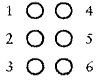
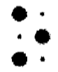

## 03 - 布莱叶盲文与二进制码

> Latest: Thu Dec 17 11:27:46 CST 2020

**1 - 点码单元**

都被编码成2x3的点码单元中的一个或多个凸起的点, 点通常使用1到6的数字编号

大点表示一个凸起的点，小点则表示其对应的位置是平的

**2 - 换档码(shift codes)**

*  表示字符串缩写 `ble`的码字很重要，因为当它不是用来表示单词的一部分时，它的出现就意味着之后的码字应该被译为数字
* 改变了后面编码的意义- 从表示字母到表示数字，又从表示数字回到表示字母
* 他们改变着作用域内编码的含义，直到作用域结束

**3 - 逃逸码(escape codes)**

* 6号凸点-大写字母标识符，这个符号表示它之后的字母都将译为大写
* 逃逸码让你逃离对编码串单独的一成不变的解析，而转入一种新的解析方式中。
