## 11 - 门

> Latest: Mon Dec 21 16:45:24 CST 2020

### A - 继电器 / 缓冲器(buffer)

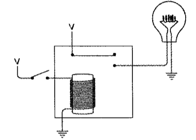
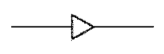

### B - 反向器(inverter)

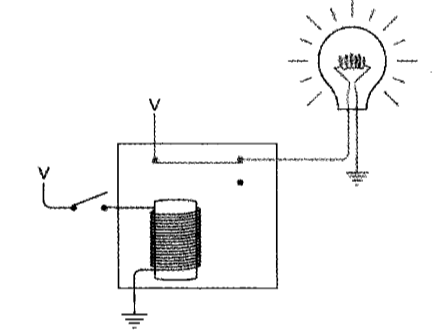
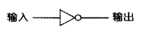

### 1 - 与门

> 两个继电器串联

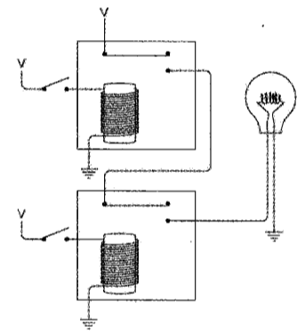
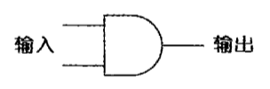

### 2 - 或门

> 两个继电器并联

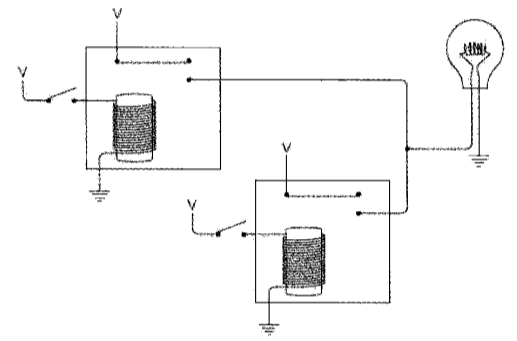
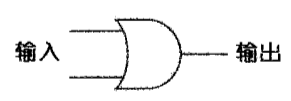

### 3 - 或非门

> 两个反向器串联

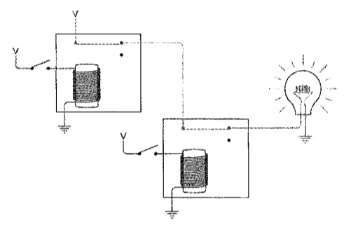
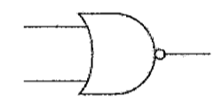

### 4 - 与非门

> 两个反向器并联

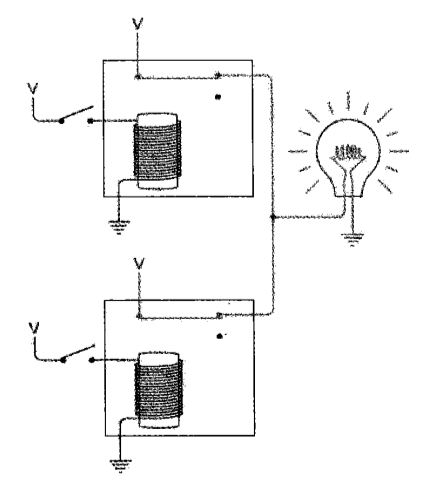
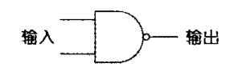

## Ref

* [【硬件科普】带你认识CPU第00期——什么是MOSFET](https://www.youtube.com/watch?v=P91wpwVGH6M&list=RDCMUCYbH8CWlZkNgoE8EY0SoE3g&index=1)
* [C语言 利用半导体晶体管设计1bit内存单元](https://www.bilibili.com/video/BV1qV4y1s7M6/?spm_id_from=333.788)
