## 12 - 二进制加法器

> Latest: Mon Dec 21 17:18:25 CST 2020

### 1 - 二进制加法表

> 一对二进制数相加的结果中具有两个数位，其中一个叫做**加法位（sum bit）**，另一位则叫做**进位位（carry bit）**

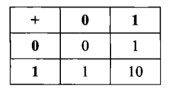
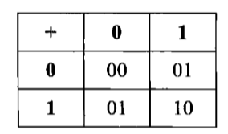

### 2 - 进位(carry bit)

> 利用与门可以计算两个二进制加法的进位

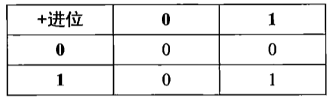

### 3 - 加法位(sum bit)

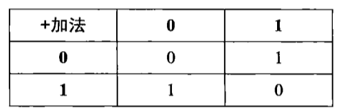

**具体实现**

`(A OR B) AND (A NAND B)`

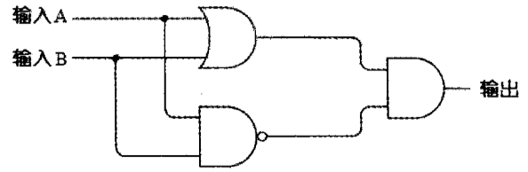
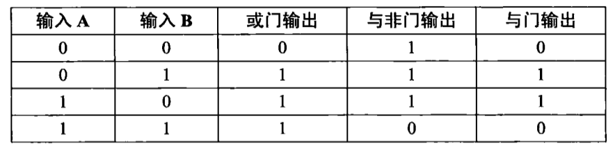

这个电路有个专门的名字，叫做异或门，简写XOR

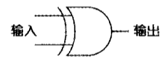
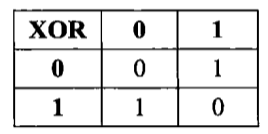

### 4 - 半加器(Half Adder)

> 两个二进制数相加的结果是由异或门的输出给出的，而进位位是由与门的输出给出的

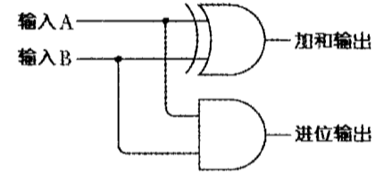
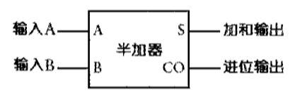

### 5 - 全加器(Full Adder)

> 两个半加器和一个或门做如下连接

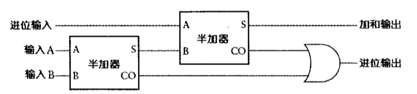
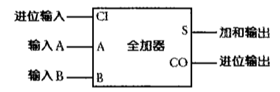

### 6 - 8 位加法器

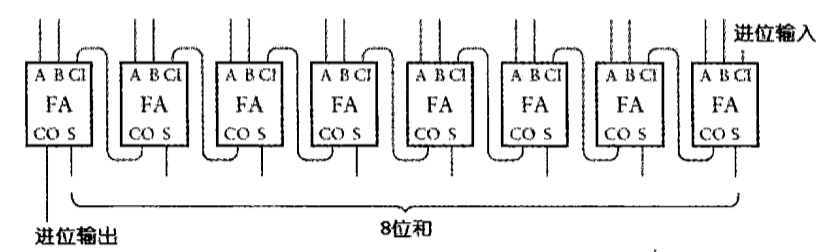
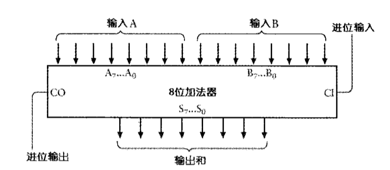
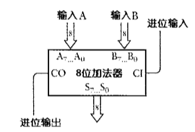
       
###  7 - 16 位加法器

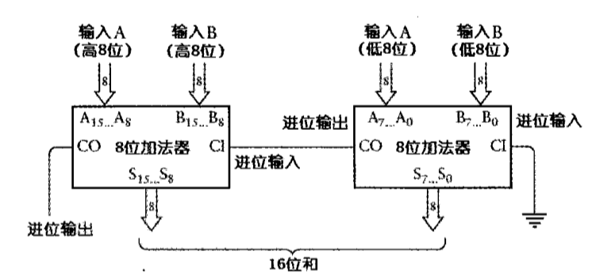

