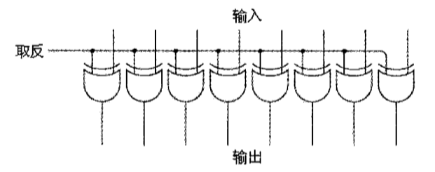
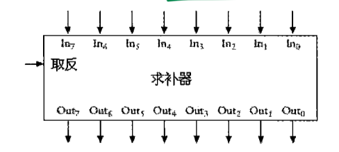

## 13 - 如何实现减法

> Tue Dec 22 10:26:49 CST 2020

### 1 - 减法避免借位

**10 进制**

> 从一串 9 中减去一个数叫做对 9 求补数


```
253 - 176
253 - 176 + 1000 - 1000
253 - 176 + 999 + 1 - 1000
253 + (999 - 176) + 1 - 1000
(999 - 176) + 253 + 1 - 1000
```

1. 首先要从 999 中减去减数（求补数）
*  将补数与原来的被减数相加
*  最后再将结果加 1， 并减去 1000


**2 进制**

> * 在二进制数减法中，减数是从一串1中减去的，结果称为 1 的补数
> * 在求对 1 的补数时，只需将原来的二进制数中的 1 变为 0， 将 0 变为 1 即可。
> * 因此对 1 求补数有时也会称为相反数或反码

```
253 - 176
111 1101 - 1011 0000
111 1101 + (1111 1111 - 1011 0000) + 1 - 1 0000 0000
(1111 1111 - 1011 0000) + 111 1101 + 1 - 1 0000 0000
```

1. 用 `1111 1111 (255)` 减去减数（求补数）
2.  将补数与被减数相加
3. 将结果加 `1` 减去 `1 0000 0000 (256)`

**上溢/下溢**

* 上溢（overflow）：在加法中得到大于255
* 下溢（underflow）：在减法中得到了负数


### 2 - 求补器(One's Complement)





### 3 - 负数在二进制中是如何表示的

* 10的补数。为了将三位负数转化为10的补数，我们用 999 减去它再加 1
* 计算2的补数，则首先要计算1的补数，然后再加1。这等价于将每位取反再加1