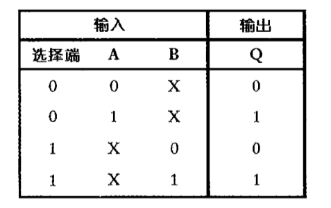
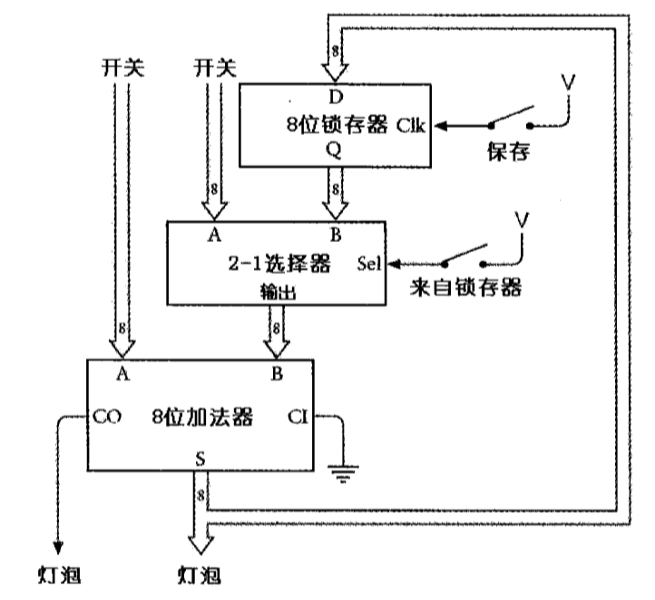

## 14 - 反馈与触发器

> Tue Dec 22 11:26:14 CST 2020

### 1 - 振荡器 / 时钟

反向器本质上就是一个继电器，而继电器将状态取反以得到另一个状态是需要一点点时间的

* 振荡器又经常被称为时钟（clock），通过震荡进行计数也是一种计时方式。
* 振荡器从某个初始状态，经过一段时间又回到先前的初始状态的这一段间隔定义为振荡器的一个循环，或称为一个周期
* 一个循环所占用的时间就是该振荡器的周期
* 周期的倒数就是振荡器的频率
* 每秒钟的循环次数 /  赫兹 Hz

### 2 - 反馈 / 触发器

* 左边或非门的输出是右边或非门的输入，而右边或非门的输出是左边或非门的输入。这种连接方式我们称之为反馈（feedback）
* 当两个开关都断开时，电路有两个稳定态，这类电路统称为触发器（Flip-Flop）
* 触发器电路可以保持信息，它可以记住某些信息

### 3 - R-S（Reset-Set，复位/置位）触发器

R-S 触发器最突出的特点在于，它可以记住那个输入端的最终状态为1

* 置位：把 Q 设为 1
* 复为：把 Q 设为 0

### 4 - 电平触发的D型触发器 / 1位存储器

这个电路也可以被称为 1 位存储器

### 5 - 8位锁存器

### 6 - 选择器

### 7 - 升级加法器

### 8 - 清零(Clear)

## 9 - 边沿触发(edge-triggered)

* 只有当时钟从 0 跳变到 1 时，才会引起输出的改变(瞬间)
* 边沿出发的 D 型触发器由两级R-S触发器按如下方式连接

## 10 - 分频器

把这个图顺时针转转 90 度，然后读一读每一行的 4位数字

## 11 - 带预置和清零功能的边沿型出发器

* 当预置信号为 1 时，Q变为1
* 当清零信号为 1 时，^Q 变为 1 