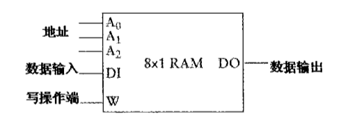

## 16 - 存储器组织

> Tue Dec 22 11:43:32 CST 2020

### 1 - 锁存器

### 2 - 8-1数据选择器

### 3 - 3-8 译码器

### 4 - 随机访问存储器

Random Access Memor / RAM

可存储 8 个独立比特的RAM 

**1 - 8x1**

以 8X1（读作8乘1）的方式组织起来, 阵列以 1 比特作为存储单位，共存储8个单位的数据

**2 - 8*2**

> 可存储的二进制数依然是8个， 但每个数的位宽为 2 位

**3 - 16*1**

> 容量为16个单位，每个单位为 1 位

* RAM 阵列的存储容量与其地址输入端的数量有直接的联系

### 5 - 64KB的RAM阵列

* 65,536 是一个约整数，转换为幂的形式就是 2(16), 这个RAM阵列需要配备 16 位的寻址段
* 该地址恰好可以用 2 个字节表示，将地址转化为十六进制就是 0000h ~ FFFFh

