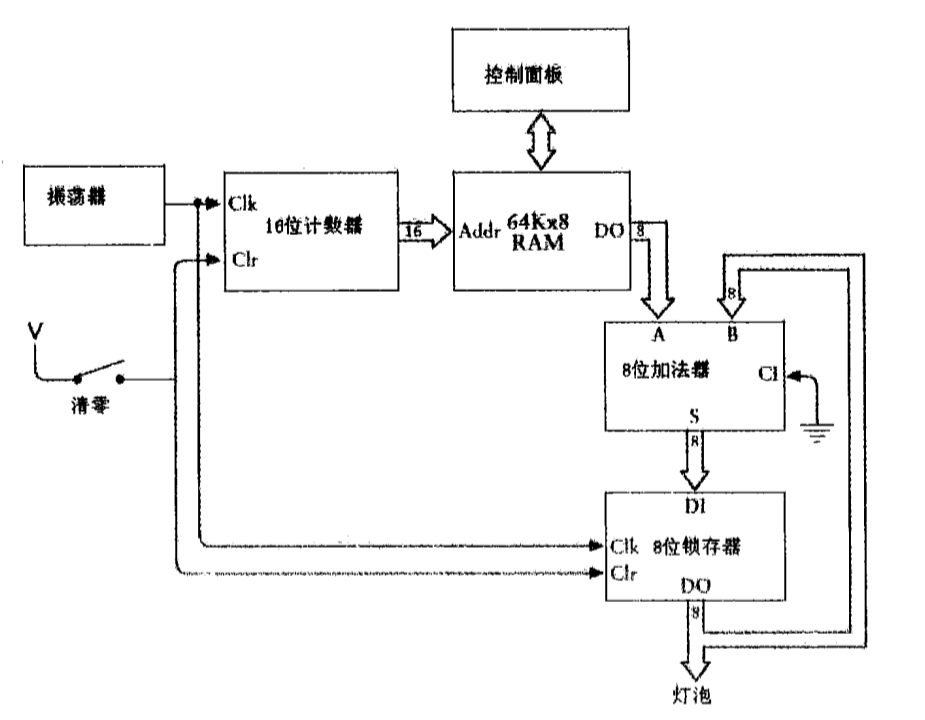
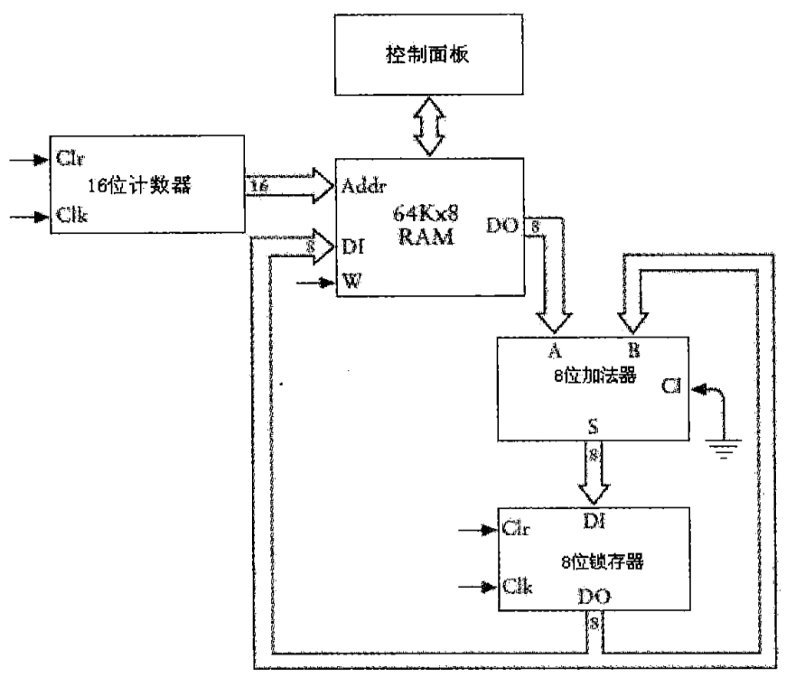
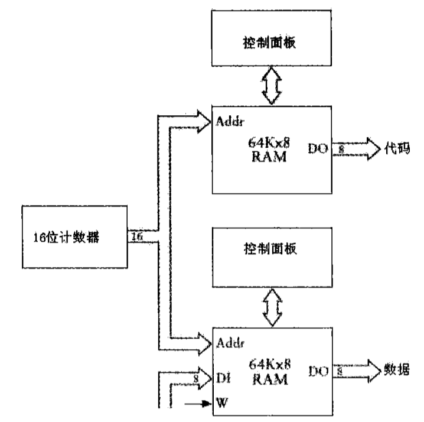
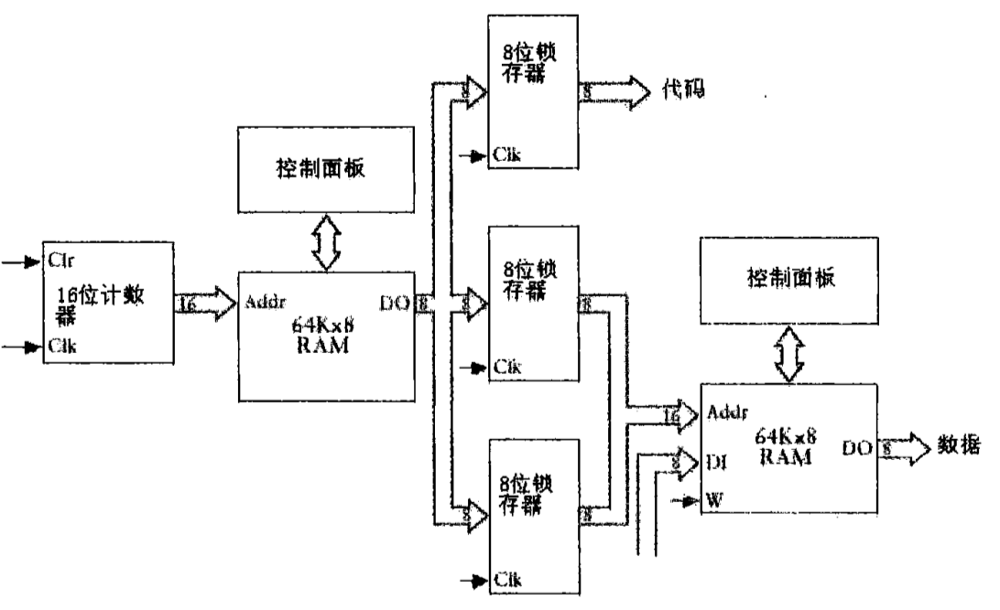
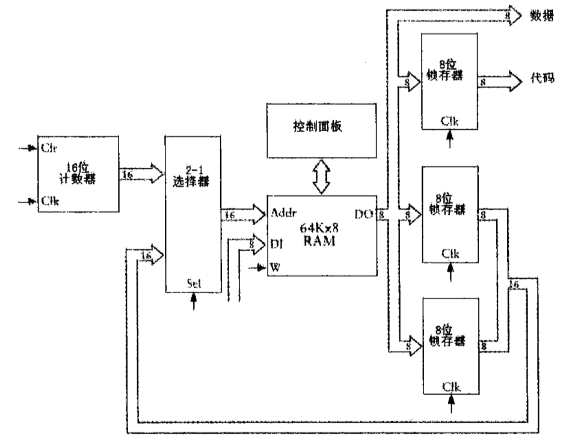
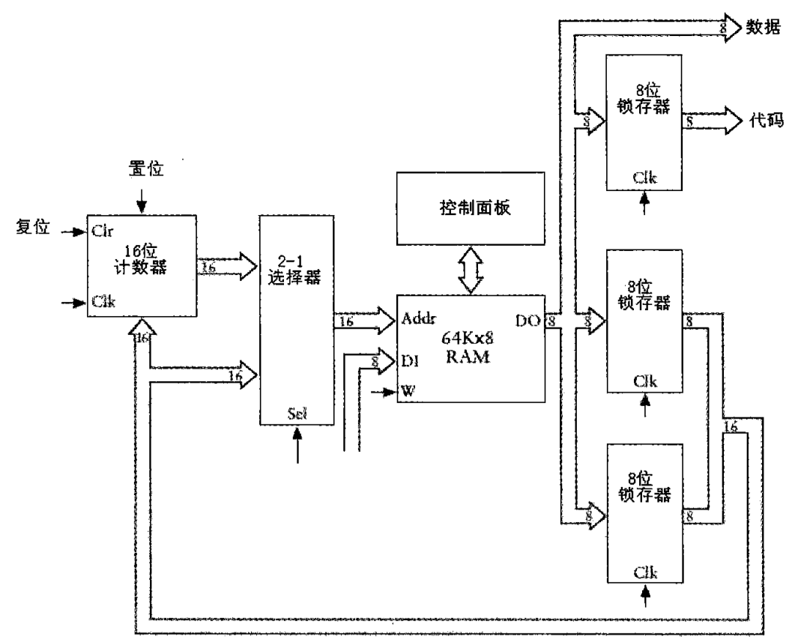
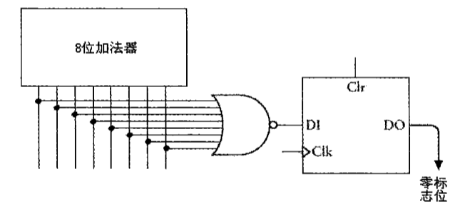
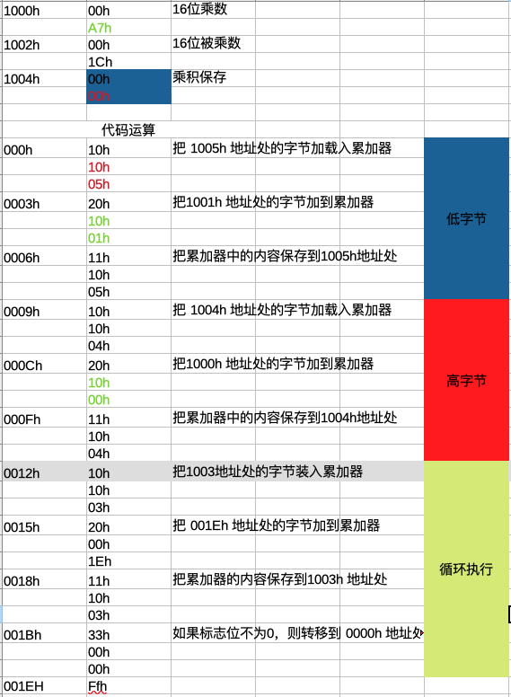

## 17 自动操作

**学习记录**

* `Tue Sep 15 16:36:44 CST 2020`

**1 - 把 RAM 阵列和累加器连接起来**

* 用来累加多个数的锁存器称做累加器

**2 - 把运算结果存回到 RAM 阵列中去**

**3 - 操作码**

* 对于 RAM 阵列中的每一个数，我们还需要用一些数字代码来标识加法器要做的每一项工作：加载、相加、保存和终止。
* 以这种方式使用的数字代码常常被称为指令码或操作码(opcode)。它们指示电路要执行某种操作

**4 - 8位设备处理16位数据**

* 先单独处理最右边的字节（低字节），然后再计算最左边的字节（高字节）
* 高字节使用 `进位锁存器` 进位加法 / 借位减法
* 只要进行多字节加法运算，不管实际是否需要，都应该使用 Add with Carry指令

**5 - 3字节指令**

* 每个指令在存储器中占据3个字节的空间，其中第一个字节位代码本身，另外两个字节用来存放1个16位存储单元地址

* 从存储器中取出指令的过程称为取指令
* 机器响应指令码做一系列操作的过程称为执行指令

**6 - 使用一个RAM阵列**

**7 - Jump实现**

* Jump 指令 从某个指定的地址开始寻址。通过作用于 16 位计数器实现其功能。
* 从RAM阵列锁存得到的16位地址作为计数器置位信号的输入

**8 - 条件跳转 / 零锁存器**

* 增加 零锁存器
* 当加法器的输出全为 0 时， 零标志为等于 1；当加法器的输出不全为 0 时，零标志位等于 0。
* `FFh` 与 `1Ch` 相加的结果与从 `1Ch` 中减去 1 的结果相同，都是 `1Bh`
* 条件跳转指令将它与我们以往设计的加法器区别开来，能否控制重复操作或者循环是计算机和计算器的区别

**9 - 汇编语言**

* 通常而言，机器码都分配了对应的简短助记符，这些助记符都是大写字母表示
* 位于助记符右侧的称为参数 / 目标操作数 / 源操作数
* 通过在一个十六进制地址后面加一个冒号，可以表示某个指令保存在某个特定的空间
* 两个字节都是以逗号分开的，它表示第一个字节保存在左侧的地址空间中，第二个字节保存在该地址后的下一个地址空间中
* 在编码时最好不要使用实际的数字地址，因为他们是可变的。
* 用标号来指代存储器中的地址空间是个较好的办法
